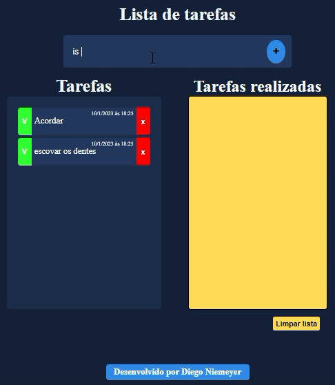
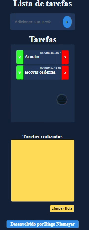

<h1 align="center"> LISTA DE TAREFAS </h1>

<h2 align="center">Descrição do projeto </h2>

Foi desenvolvido um projeto que cria uma tarefa e o usuário pode obter uma lista de tarefas realizadas. projeto responsivo .

 

Vídeo 1 Computador: 

 

Vídeo 2 Móvel: 

 

 

<h2 align="center"> Acesso ao projeto </h2>

 Você pode acessar o projeto final clicando aqui: https://dniemeryers.github.io/lista-de-tarefa/ 

 
<h2 align="center"> TECNOLOGIAS UTILIZADAS</h2>

<h2 align="center"> APRENDIZADO </h2>

- Foi realizado a criação de elementos filhos dinamicamente dentro do elemento pai usando javascript para fazer a manipulação do DOM.

- foi realizado passagem de parametros entre funções.

- Foi realizado remoção de elementos filhos individuais e todos elementos filhos dentro do elemento pai.

- Foi criado data e hora na criação do elemento filho e data e hora na transferencia do elemento filho para outro elemento.

 
<h2 align="center"> Pessoa desenvolvedora do projeto </h2>

|  Diego Niemeyer |
| :---: |
 
